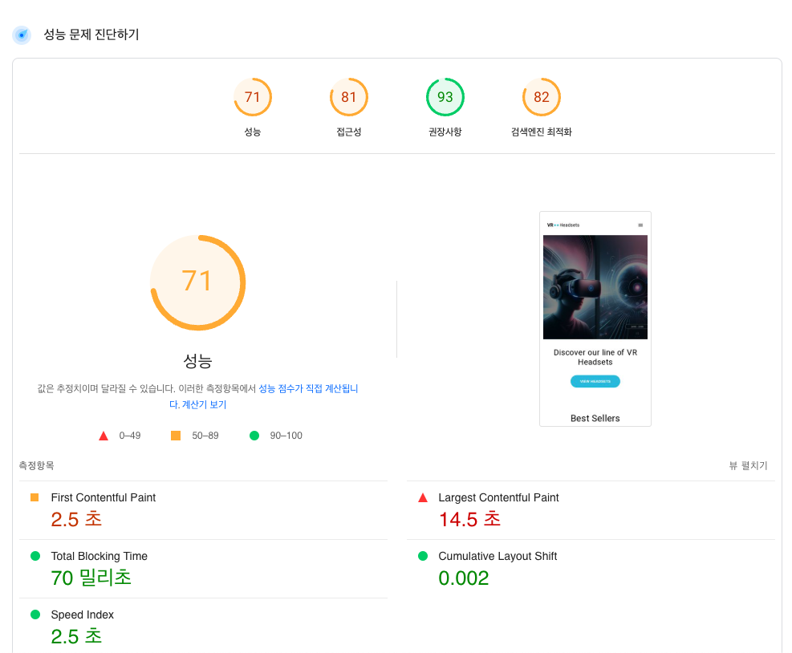
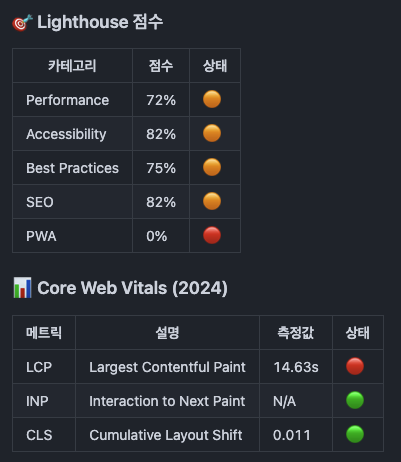
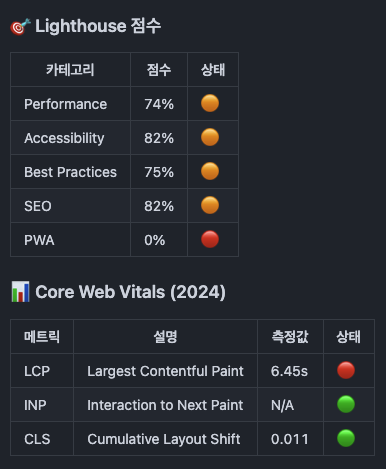
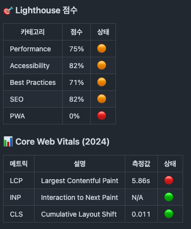
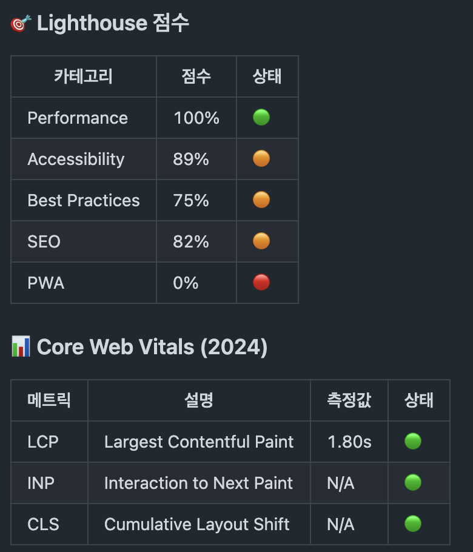

# 바닐라 JS 프로젝트 성능 개선

- url: https://d23tja75kau50u.cloudfront.net/

## 성능 개선 보고서

처음

### 개선 방법

- 이미지

  - 이미지 변환
    |기존 |변경 |
    |------------|--------|
    |.jpg , .png | .webp |
    | | |
    - 결과 : LCP 측정값 14.63s -> 6.45s 감소
  - 이미지 사이즈 , lazy 추가
    
    - 결과 : LCP 측정값 6.45s -> 5.86s 감소

- 폰트

  - URL을 직접 가져와 Fonts 호출하는 부분 제거
  - ttf파일을 통한 Fonts 최적화

- JavaScript
  - defer를 이용한 script 호출로 JavaScript 최적화
  - cookie-consent.js 저장 후 호출

### 개선후

- 개선 요약
  - Images, Fonts, JavaScript의 최적화로 인해 성능 및 접근성 개선
  - Images 파일 압축 및 폰트 ttf파일 사용을 통해 FCP 및 LCP 성능이 크게 개선
  - defer 속성을 사용하여 스크립트 로딩을 최적화함으로써 TBT 성능 개선
